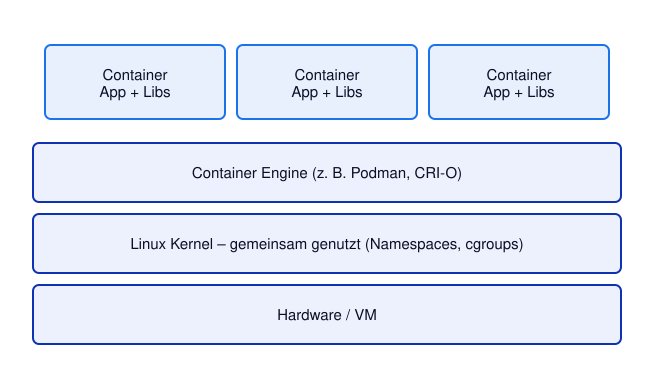

# Kapitel 1: Container
<!-- level: rookie -->

## Warum Container? Vergleich zu VMs

| Merkmal | Virtuelle Maschine | Container |
|---|---|---|
| Isolation | Vollständige OS-Isolation | Prozess-Isolation (Kernel shared) |
| Startzeit | Minuten | Sekunden / Millisekunden (nur die Anwendung) |
| Overhead | Hoch (komplettes Gast-OS) | Gering (nur Prozess + Libs) |
| Image-Größe | GB | MB |
| Portabilität | Eingeschränkt | Sehr hoch (OCI-Standard) |

### Schlüsselkonzepte
- **Namespaces** (Linux): Isolieren PID, Network, Mount, UTS, IPC, User
- **cgroups** (Linux): Begrenzen CPU, Speicher, I/O
- **Union Filesystems**: Layer-basierte Images (overlayfs)



---

## Podman oder Docker?

Die Beispiele in diesem Seminar verwenden **Podman**. Sie funktionieren genauso mit
**Docker** – einfach `podman` durch `docker` ersetzen: Podman ist bewusst
kommandozeilenkompatibel zu Docker, beide erzeugen und starten dieselben (OCI-)Images.

| | Podman | Docker |
|---|---|---|
| Architektur | kein Daemon – jeder Container ist ein eigener Prozess | zentraler Daemon (`dockerd`) |
| Rechte | standardmäßig ohne root (rootless) | Daemon läuft als root (Rootless-Modus optional) |
| macOS / Windows | Podman Desktop bzw. `podman machine` (Linux-VM) | Docker Desktop (Linux-VM; Lizenzbedingungen für Unternehmen beachten) |
| Mehrere Container gemeinsam | `podman pod` – wie ein Pod in Kubernetes | Docker Compose |
| Image-Format | OCI | OCI |

Kleine Unterschiede, die in den Übungen auffallen können:

- **Containerfile vs. Dockerfile:** Docker sucht ohne Angabe nur nach einer Datei `Dockerfile`.
  Die Beispiele geben die Datei deshalb immer mit `-f 01-container/Containerfile` an.
- **`:Z` bei Volumes** setzt SELinux-Labels und ist nur auf Linux-Systemen mit SELinux
  (Fedora, RHEL) nötig. Mit Docker Desktop auf macOS/Windows kann es entfallen.
- **Multi-Architektur-Build:** `FROM --platform=$BUILDPLATFORM` im Containerfile benötigt bei
  Docker BuildKit (Standard seit Docker 23).
- **Kurze Image-Namen** (`ubi-minimal`) löst Docker immer gegen Docker Hub auf, Podman fragt
  nach der Registry – daher verwenden die Beispiele immer den vollständigen Namen.

Wer nur Docker installiert hat, kann sich die Umstellung mit einem Alias sparen:
`alias podman=docker`.

## Podman Basics

Podman ist eine Container-Engine ohne Daemon (kein root nötig) und stellt dieselben Kommandos
bereit wie Docker:

```bash
# Image herunterladen
podman pull registry.access.redhat.com/ubi10/ubi-minimal:latest

# Container starten (führt einen Befehl aus und beendet sich wieder)
podman run --rm registry.access.redhat.com/ubi10/ubi-minimal:latest cat /etc/os-release

# Container interaktiv
podman run --rm -it registry.access.redhat.com/ubi10/ubi-minimal:latest /bin/bash

# Demo-Anwendung im Hintergrund starten
# Port-Mapping: Host-Port 8080 → Container-Port 8080
podman run -d -p 8080:8080 --name demo quay.io/ghilling/quarkus-demo:1.0

# Laufende Container anzeigen
podman ps

# Alle Container (inkl. gestoppter)
podman ps -a

# Anwendung aufrufen (--retry: wartet, bis die Anwendung gestartet ist)
curl --retry 10 --retry-all-errors --retry-delay 2 http://localhost:8080/

# Logs anzeigen
podman logs demo

# In laufenden Container einloggen
podman exec -it demo /bin/bash

# Container stoppen und entfernen
podman stop demo
podman rm demo

# Images anzeigen
podman images

# Image entfernen
podman rmi quay.io/ghilling/quarkus-demo:1.0
```

---

## Ephemeral – Was bedeutet das bei Containern?

Container sind **vergänglich** (ephemeral):
- Alles, was in einen Container geschrieben wird, geht beim Löschen des Containers verloren (was nicht verwunderlich ist.).
- Der Container-Prozess schreibt in das Container-eigene Dateisystem (oberste Layer).
- Beim `podman stop && podman rm` gehen alle Daten verloren.

```bash
# Beispiel: Daten gehen verloren
podman run --name ephemeral registry.access.redhat.com/ubi10/ubi-minimal:latest \
  sh -c "echo hallo > /tmp/test.txt && cat /tmp/test.txt"
# → /tmp/test.txt existiert, solange der Container existiert.
#   Stoppen und erneutes Starten behält die Datei bei!
podman rm ephemeral
# → Container gelöscht, Datei weg.

# Lösung: Volumes mounten für persistente Daten
mkdir -p ~/demo-daten
echo "Ich überlebe den Container" > ~/demo-daten/test.txt
podman run --rm -v ~/demo-daten:/daten:Z registry.access.redhat.com/ubi10/ubi-minimal:latest cat /daten/test.txt
# Das ':Z' setzt passende SELinux-Labels für das gemountete Verzeichnis.
```


### Konsequenzen für Anwendungen:
- Konfiguration **nicht** in Container einbauen → Umgebungsvariablen/Konfigurationsdateien.
- Logs auf **stdout/stderr** schreiben (nicht in Dateien): Diese werden von der Runtime "eingesammelt".
- Zustand (State) **extern** speichern: Host-Verzeichnisse (podman) oder PersistentVolumeClaims (Kubernetes)

---

## Container konfigurieren

### 1. Umgebungsvariablen (empfohlen für Geheimnisse & Konfiguration)
```bash
podman run --rm -e MY_VAR=value -e DB_URL=jdbc:postgresql://host/db \
  registry.access.redhat.com/ubi10/ubi-minimal:latest printenv MY_VAR DB_URL
```

### 2. Dateien via Volume mounten
```bash
echo "greeting: Hallo" > ~/demo-daten/config.yml
podman run --rm -v ~/demo-daten/config.yml:/app/config.yml:ro,Z \
  registry.access.redhat.com/ubi10/ubi-minimal:latest cat /app/config.yml
```

### 3. Kommandozeilenargumente

Alles nach dem Image-Namen ersetzt das im Image hinterlegte `CMD`:

```bash
podman run --rm registry.access.redhat.com/ubi10/ubi-minimal:latest echo "Hallo aus dem Container"
```

---

## Image Build – Containerfile

Ein **Containerfile** (= Dockerfile) beschreibt den Build-Prozess eines Images.

### Beispiel: Demo-Anwendung

Das [Containerfile](./Containerfile) baut die Demo-Anwendung in zwei Stufen
(Multi-Stage-Build): Die erste Stufe enthält Maven und JDK zum Bauen, die zweite nur
noch die Java-Runtime und die fertige [Quarkus](https://quarkus.io/)-Anwendung.

```dockerfile
# Stage 1: Build
# --platform=$BUILDPLATFORM: Der Build läuft immer nativ auf dem Build-Rechner,
# auch wenn ein Image für eine andere Architektur gebaut wird (Java-Bytecode
# ist plattformunabhängig).
FROM --platform=$BUILDPLATFORM registry.access.redhat.com/ubi10/openjdk-21:latest AS builder

USER root
WORKDIR /build

COPY demo-app /build/

RUN mvn -q -B package -DskipTests

# Stage 2: Runtime (nur JRE + Anwendung)
FROM registry.access.redhat.com/ubi10/openjdk-21-runtime:latest

# Version der Anwendung, z. B. podman build --build-arg APP_VERSION=1.1 ...
ARG APP_VERSION=dev
ENV DEMO_VERSION=${APP_VERSION}

WORKDIR /app

USER root
RUN mkdir -p /var/demo/html && \
    echo "<html><body><h1>Hallo von Container!</h1><p>Version ${APP_VERSION}</p></body></html>" > /var/demo/html/index.html && \
    chown -R 1001:0 /var/demo/html && \
    chmod -R g=u /var/demo/html

COPY --from=builder /build/target/quarkus-app/ /app/

# Non-Root User (kompatibel mit restricted-v2 SCC)
USER 1001

EXPOSE 8080

CMD ["java", "-jar", "/app/quarkus-run.jar"]
```

```bash
# Image bauen (aus dem Repository-Root)
podman build -t demo-app:1.0 -f 01-container/Containerfile 01-container

# Image starten
podman run -d -p 8080:8080 --name demo-local demo-app:1.0
curl --retry 10 --retry-all-errors --retry-delay 2 http://localhost:8080/

# Aufräumen
podman rm -f demo-local
```

---

## Image Registries und Image Tags

### Registry
Eine Registry ist ein zentrales Repository für Container-Images.

| Registry | Beschreibung |
|---|---|
| `registry.access.redhat.com` | Red Hat offizielle Images |
| `quay.io` | Red Hat Quay (öffentlich + privat) |
| `docker.io` | Docker Hub |
| `ghcr.io` | GitHub Container Registry |

### Image-Namen und Tags

```
registry.example.com/namespace/image-name:tag
│──────────────────│ │───────│ │────────│ │──│
       Registry      Namespace   Image-Name  Tag
```

### Tags sind **nicht immutable**!

❗ Nur zur Illustration (`myimage` ist ein Platzhalter):

```bash
# Gleicher Tag, unterschiedlicher Inhalt möglich:
podman pull myimage:latest  # heute = Version 1.5
# nächste Woche:
podman pull myimage:latest  # latest = jetzt Version 2.0 !
```

**Besser:**:
- **Digest**: `myimage@sha256:abc123...` (unveränderbar)
- **Versionierte Tags**: `myimage:1.5.2` (Konvention, aber keine Garantie!)

❗ Nur mit eigenem Registry-Account (`quay.io/myorg` durch eigene Organisation ersetzen,
vorher `podman login quay.io`):

```bash
# Image taggen
podman tag demo-app:1.0 quay.io/myorg/demo-app:1.0

# Image pushen
podman push quay.io/myorg/demo-app:1.0
```

---

## Weiterführende Links

- [Kubernetes: Container-Images](https://kubernetes.io/docs/concepts/containers/images/)
- [OpenShift 4.22: Images](https://docs.redhat.com/en/documentation/openshift_container_platform/4.22/html/images/index)

Siehe auch [99-anhang/DOCUMENTATION.md](../99-anhang/DOCUMENTATION.md) für die vollständige Liste.
