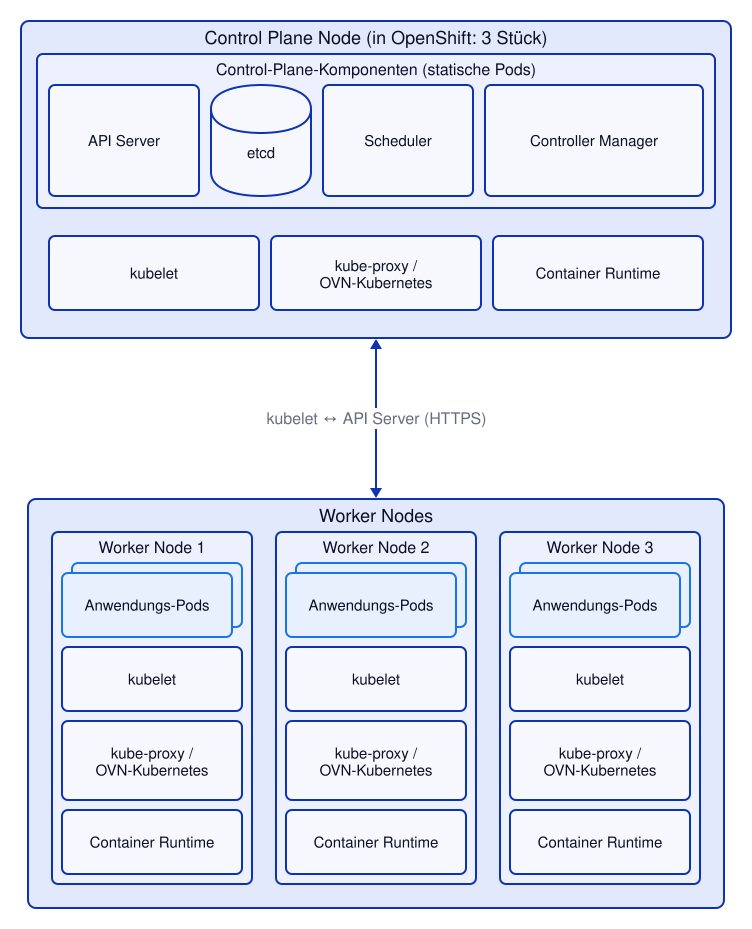
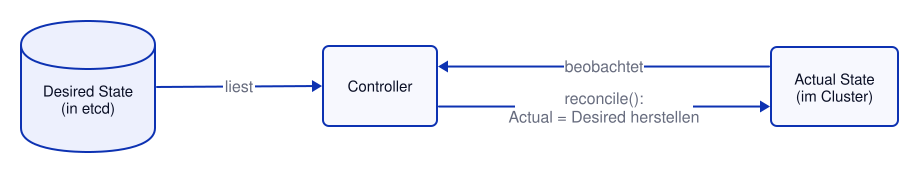
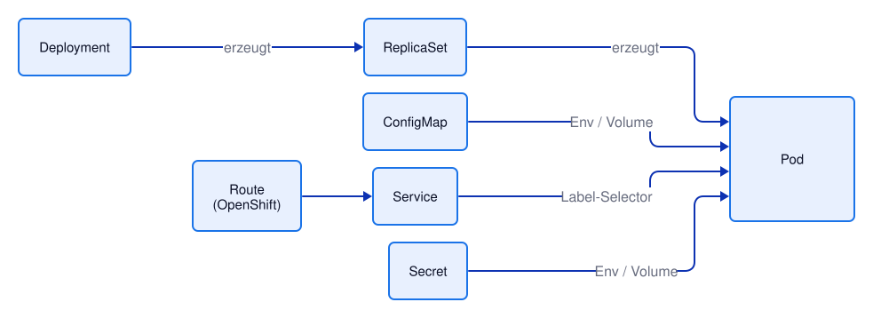

# Kapitel 2: Kubernetes Basics
<!-- level: rookie -->

## Architektur



### Komponenten

**Control Plane** (in OpenShift: 3 Control-Plane-Nodes für Hochverfügbarkeit):
- **API Server**: Einziger Einstiegspunkt; REST-API; Authentifizierung & Autorisierung
- **etcd**: Verteilter Key-Value-Store; gesamter Cluster-Zustand
- **Scheduler**: Entscheidet, auf welchem Node ein Pod läuft
- **Controller Manager**: Führt Controller aus (ReplicaSet, Deployment, …)

Die Control-Plane-Komponenten laufen selbst als (statische) Pods – deshalb gibt es auch auf
den Control-Plane-Nodes ein kubelet und eine Container Runtime.

**Auf jedem Node** (Control Plane und Worker):
- **kubelet**: Agent auf jedem Node; kommuniziert mit dem API Server; startet Container
- **kube-proxy**: Netzwerk-Regeln (Services → Pods). In OpenShift übernimmt das
  **OVN-Kubernetes** (das Netzwerk-Plugin) – dort gibt es keinen kube-proxy.
- **Container Runtime**: z. B. CRI-O (OpenShift), containerd

Auf den **Worker Nodes** laufen die Anwendungs-Pods.

---

## Der Control-Loop (Reconciliation)

Kubernetes arbeitet nach dem **Desired State** Prinzip:



**Beispiel:**
- Ich sage: "Ich möchte 3 Replicas"
- Kubernetes sieht: Es laufen nur 2
- Controller erstellt einen weiteren Pod → Actual = Desired

### Baukastensystem

Kubernetes besteht aus unabhängigen, kombinierbaren Ressourcentypen (beispielhaft):



---

## Tools: kubectl und oc

### kubectl (Standard Kubernetes CLI)
```bash
# Cluster-Verbindung prüfen
kubectl cluster-info      # ❗ benötigt Leserechte auf Cluster-Ebene

# Namespaces anzeigen
kubectl get namespaces    # ❗ benötigt Leserechte auf Cluster-Ebene

# Pods anzeigen (im aktuellen Namespace)
kubectl get pods

# Pods in einem bestimmten Namespace anzeigen
kubectl get pods -n $(oc project -q)

# Ressource erstellen/aktualisieren
kubectl apply -f 04-pods-on-kubernetes/pod.yaml

# Warten, bis der Pod bereit ist
kubectl wait --for=condition=Ready pod/demo --timeout=120s

# Ausführliche Infos
kubectl describe pod demo

# Logs
kubectl logs demo

# YAML ausgeben
kubectl get pod demo -o yaml

# Ressource löschen
kubectl delete pod demo
# oder über das Manifest:
kubectl delete -f 04-pods-on-kubernetes/pod.yaml --ignore-not-found
```

### oc (OpenShift CLI – Erweiterung von kubectl)
```bash
# Alles, was kubectl kann + OpenShift-Erweiterungen:

# Anmelden
oc login https://api.cluster.example.com:6443

# Aktuelles Projekt/Namespace anzeigen
oc project

# Alle Projekte anzeigen, auf die ich Zugriff habe
oc projects

# Projekt wechseln
oc project mein-projekt   # ❗ Namen eines eigenen Projects einsetzen

# Status anzeigen
oc status

# Route erstellen (OpenShift-spezifisch, siehe Kapitel 6)
oc expose service demo    # ❗ setzt einen Service "demo" voraus
```

---

## Anmelden in OpenShift

Wichtig: Die Anmeldung über die Web-Console funktioniert immer. Für das ```oc login```-Command muss entweder username/password verfügbar sein, oder man verwendet die Option ```--web```, um über ein Browser-Fenster ein login-Token zu erhalten. Dies ist immer dann notwendig, wenn SSO-Verfahren mit 2-FA genutzt werden.

### Web-Console

1. Browser öffnen: `https://console.apps.cluster.example.com`
2. Mit Benutzername & Passwort anmelden
3. Oben rechts → "Copy login command"
4. Token kopieren → in Terminal einfügen

### Commandline

```bash
# Mit Benutzername/Passwort
oc login https://api.cluster.example.com:6443 -u developer -p password

# Mit Token (aus Web-Console kopiert)
oc login https://api.cluster.example.com:6443 --token=sha256~xxxxxxxxxxxx

# Verbindung prüfen
oc whoami
oc cluster-info   # ❗ benötigt Leserechte auf Cluster-Ebene

# kubeconfig anzeigen
cat ~/.kube/config
```

### kubeconfig

Die Konfigurationsdatei `~/.kube/config` enthält:
- Cluster-Adressen
- Benutzer-Tokens / Zertifikate
- Aktiven Context (welcher Cluster/User/Namespace)

```bash
# Alle Contexts anzeigen
kubectl config get-contexts

# Context wechseln
kubectl config use-context $(kubectl config current-context)
```

---

## Weiterführende Links

- [Kubernetes: Komponenten des Clusters](https://kubernetes.io/docs/concepts/overview/components/)
- [Kubernetes: kubectl-Referenz](https://kubernetes.io/docs/reference/kubectl/)
- [OpenShift 4.22: CLI Tools](https://docs.redhat.com/en/documentation/openshift_container_platform/4.22/html/cli_tools/index)
- [OpenShift 4.22: API Overview](https://docs.redhat.com/en/documentation/openshift_container_platform/4.22/html/api_overview/index)

Siehe auch [99-anhang/DOCUMENTATION.md](../99-anhang/DOCUMENTATION.md) für die vollständige Liste.
