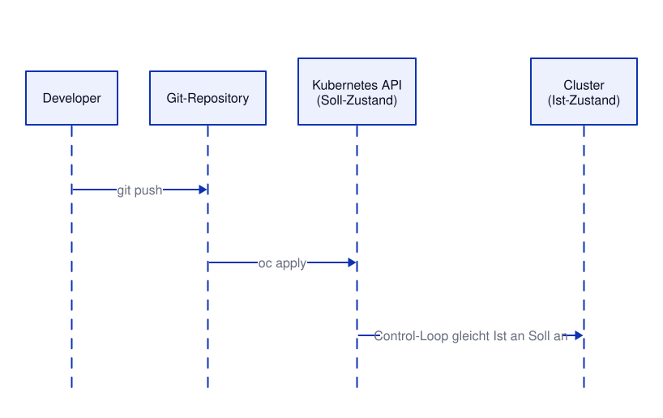

# Kapitel 5: Automation – Kubernetes Manifeste & GitOps
<!-- level: rookie -->

## Kubernetes Manifeste

Kubernetes-Ressourcen werden als **deklarative YAML-Manifeste** beschrieben.

### Struktur eines Manifests

```yaml
apiVersion: apps/v1        # API-Gruppe und Version
kind: Deployment           # Ressourcentyp
metadata:
  name: demo               # Name der Ressource
  labels:
    app: demo
spec:                      # Gewünschter Zustand (desired state)
  replicas: 2
  ...
```

---

## GitOps mit oc apply / kubectl apply

**GitOps**: YAML-Manifeste in Git verwalten → automatisch im Cluster anwenden.

```bash
# Einzelne Datei anwenden
kubectl apply -f 05-automation/deployment.yaml

# Komplettes Verzeichnis anwenden
kubectl apply -f 05-automation/

# Rekursiv (inkl. Unterverzeichnisse)
kubectl apply -R -f 05-automation/

# Dry-Run (Was würde passieren?)
kubectl apply -f 05-automation/deployment.yaml --dry-run=client

# Server-seitiger Dry-Run
kubectl apply -f 05-automation/deployment.yaml --dry-run=server

# Diff anzeigen (was ändert sich?)
kubectl diff -f 05-automation/deployment.yaml
```

### Ablauf GitOps



---

## Arbeiten mit Manifesten

### Ressourcen anzeigen

```bash
# Manifest eines laufenden Objekts ausgeben
kubectl get deployment demo -o yaml

# Mehrere Ressourcentypen auf einmal
kubectl get deployments,replicasets,pods,services

# Alle API-Ressourcentypen
kubectl api-resources

```
### Labels und Selektoren

```bash
# Ressourcen mit Label filtern
kubectl get pods -l app=demo

# Label hinzufügen
kubectl label deployment demo version=v2
kubectl get deployments --show-labels

# Label entfernen
kubectl label deployment demo version-
```

### Kustomize (eingebaut in kubectl)

```bash
# Verzeichnis mit kustomization.yaml anwenden (Details in Kapitel 9)
kubectl apply -k 09-kustomize/overlays/test

# Kustomize-Output anzeigen
kubectl kustomize 09-kustomize/overlays/test
```

---

## Manifeste in diesem Kapitel

- `deployment.yaml` – Deployment der Demo-Anwendung

> Die Manifeste enthalten bewusst **keinen** `namespace` – sie werden immer in das
> aktuell aktive Project angewendet (`oc project`).

---

## Weiterführende Links

- [Kubernetes: Deklaratives Management von Objekten](https://kubernetes.io/docs/tasks/manage-kubernetes-objects/declarative-config/)
- [Kubernetes: Kustomization](https://kubernetes.io/docs/tasks/manage-kubernetes-objects/kustomization/)
- [OpenShift 4.22: GitOps](https://docs.redhat.com/en/documentation/openshift_container_platform/4.22/html/gitops/index)
- [OpenShift 4.22: CI/CD Overview](https://docs.redhat.com/en/documentation/openshift_container_platform/4.22/html/cicd_overview/index)

Siehe auch [99-anhang/DOCUMENTATION.md](../99-anhang/DOCUMENTATION.md) für die vollständige Liste.
