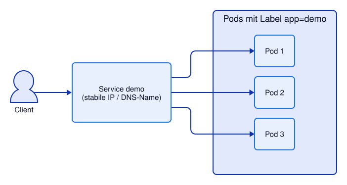
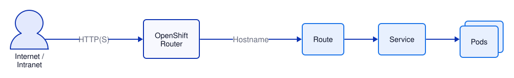

# Kapitel 6: Networking – Services, Routes & Port-Forward
<!-- level: rookie -->

## Vorbereitung

Für dieses Kapitel wird das Deployment aus Kapitel 5 benötigt:

```bash
oc apply -f 05-automation/deployment.yaml
oc rollout status deployment/demo
```

## Services

Ein **Service** stellt eine stabile Netzwerkadresse für eine Gruppe von Pods bereit.



### Service-Typen

| Typ | Beschreibung |
|---|---|
| `ClusterIP` | Nur intern erreichbar (Standard) |
| `NodePort` | Auf jedem Node-Port erreichbar |
| `LoadBalancer` | Externer Load Balancer (Cloud) |
| `ExternalName` | DNS-Alias auf externen Service |

### Service via Label-Selector

```yaml
apiVersion: v1
kind: Service
metadata:
  name: demo
spec:
  selector:
    app: demo         # Wählt alle Pods mit label app=demo
  ports:
    - port: 8080      # Service-Port
      targetPort: 8080 # Container-Port
```

```bash
# Service anlegen
oc apply -f 06-networking/service.yaml

# Services anzeigen
kubectl get services
kubectl get svc

# Service-Details (Endpoints = IPs der ausgewählten Pods)
kubectl describe svc demo

# DNS innerhalb des Clusters (aus einem Pod heraus)
# Format: <service-name>.<namespace>.svc.cluster.local
oc exec deploy/demo -- curl -s http://demo.$(oc project -q).svc.cluster.local:8080/
# Kurzform (gleicher Namespace):
oc exec deploy/demo -- curl -s http://demo:8080/
```

---

## Routes (OpenShift)

Eine **Route** macht einen Service von außerhalb des Clusters erreichbar.



```bash
# Route erstellen (automatisch aus Service)
oc expose service demo

# Route anzeigen
oc get routes

# Route-URL ausgeben
oc get route demo -o jsonpath='{.spec.host}{"\n"}'

# Route aufrufen (--retry: der Router braucht ein paar Sekunden für neue Routen)
curl -s --retry 5 http://$(oc get route demo -o jsonpath='{.spec.host}')/
```

### TLS-Terminierung

```yaml
spec:
  tls:
    termination: edge        # TLS wird am Router beendet
    # termination: passthrough # TLS direkt zum Pod
    # termination: reencrypt  # TLS am Router + neuem TLS zum Pod
```

Die Route aus `route.yaml` verwendet `edge`-Terminierung und leitet HTTP auf HTTPS um:

```bash
# Route aus dem Manifest statt "oc expose"
oc delete route demo
oc apply -f 06-networking/route.yaml
curl -s --retry 5 https://$(oc get route demo -o jsonpath='{.spec.host}')/
```

---

## Troubleshooting: Port-Forward

Port-Forward ermöglicht direkten Zugriff auf einen Pod/Service ohne Route:

```bash
# Direkt auf Pod zugreifen (für Debugging)
kubectl port-forward pod/demo 8080:8080
# → http://localhost:8080 leitet auf Container-Port 8080

# Auf Service zugreifen
kubectl port-forward svc/demo 8080:8080

# Im Hintergrund
kubectl port-forward svc/demo 8080:8080 &

# Stoppen
kill %1
```

### Netzwerk-Debugging


```bash
# Temporären Debug-Pod interaktiv starten (Befehle dann in der Shell im Pod)
kubectl run debug --image=quay.io/ghilling/ubi-tools:10-latest --rm -it --restart=Never -- /bin/bash

# Oder einzelne Befehle in einem temporären Pod ausführen:
# DNS-Test
kubectl run debug --image=quay.io/ghilling/ubi-tools:10-latest --rm -i --restart=Never -- nslookup demo

# HTTP-Test
kubectl run debug --image=quay.io/ghilling/ubi-tools:10-latest --rm -i --restart=Never -- curl -s http://demo:8080/
```

### Netzwerk-Policy prüfen (Firewall, siehe Kapitel 16)

```bash
kubectl get networkpolicies
```

---

## Manifeste in diesem Kapitel

- `service.yaml` – ClusterIP Service für die Demo-Anwendung
- `route.yaml` – OpenShift Route (HTTP + TLS edge)

---

## Weiterführende Links

- [Kubernetes: Services](https://kubernetes.io/docs/concepts/services-networking/service/)
- [Kubernetes: Ingress](https://kubernetes.io/docs/concepts/services-networking/ingress/)
- [OpenShift 4.22: Networking Overview](https://docs.redhat.com/en/documentation/openshift_container_platform/4.22/html/networking_overview/index)
- [OpenShift 4.22: Ingress and Load Balancing (Routes)](https://docs.redhat.com/en/documentation/openshift_container_platform/4.22/html/ingress_and_load_balancing/index)

Siehe auch [99-anhang/DOCUMENTATION.md](../99-anhang/DOCUMENTATION.md) für die vollständige Liste.
