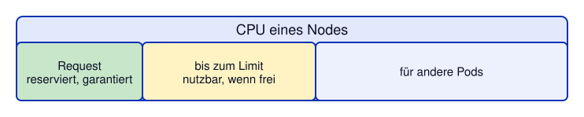

# Kapitel 8: Requests und Limits
<!-- level: rookie -->

## Überblick

| Begriff | Beschreibung |
|---|---|
| **Request** | Mindest-Ressourcen, die Kubernetes **reserviert** |
| **Limit** | Maximum, das ein Container **verbrauchen darf** |



---

## CPU

- Einheit: `m` (millicores) – 1000m = 1 CPU-Kern
- **Request**: Garantierte CPU-Zeit
- **Limit**: CPU wird gedrosselt (throttled), kein OOM-Kill

```yaml
resources:
  requests:
    cpu: "100m"    # 0.1 CPU-Kern reserviert
  limits:
    cpu: "500m"    # maximal 0.5 CPU-Kern
```

---

## Memory

- Einheit: `Mi` (Mebibyte), `Gi` (Gibibyte)
- **Request**: Garantierter Speicher
- **Limit**: Container wird **gekillt** (OOMKilled) wenn überschritten!

```yaml
resources:
  requests:
    memory: "128Mi"   # 128 MiB reserviert
  limits:
    memory: "256Mi"   # maximal 256 MiB
```

---

## Warum Requests und Limits wichtig sind

### Ohne Requests:
- Scheduler kann Pods nicht sinnvoll planen.
- Das Laufzeitverhalten von Pods ist nicht vorhersagbar.
- Tests sind nicht aussagekräftig.
- Erfahrungswerte sind nicht aussagekräftig: Die Pods einer Anwendung können zum Beispiel vor einem Deployment zufällig mehr Speicher zur Verfügung gehabt haben.

### Ohne Limits:
- Ein fehlerhafter Pod kann den ganzen Node destabilisieren
- Ein Pod kann alle Ressourcen eines Nodes verbrauchen
- Memory-Leak → alle anderen Pods sterben
- Und siehe oben: Pods zu einem Deployment können sich unter Umständen sehr unterschiedlich verhalten.

### Quality of Service (QoS) Classes

| QoS-Klasse | Bedingung | Verhalten bei Druck (CPU-Pressure, Memory-Pressure) |
|---|---|---|
| **Guaranteed** | Limits = Requests | Zuletzt gekillt |
| **Burstable** | Requests < Limits | Nach Best-Effort gekillt |
| **BestEffort** | Keine Requests/Limits | Als erstes gekillt |

---

## LimitRange (Namespace-Standard)

OpenShift/Kubernetes kann Default-Werte für Requests/Limits setzen.

❗ Nur mit Cluster-Admin-Rechten (Manifest: `cluster-specific/limitrange.yaml`):

```yaml
apiVersion: v1
kind: LimitRange
metadata:
  name: default-limits
spec:
  limits:
    - type: Container
      default:
        cpu: "500m"
        memory: "256Mi"
      defaultRequest:
        cpu: "100m"
        memory: "128Mi"
      max:
        cpu: "2"
        memory: "1Gi"
```

---

## ResourceQuota (Namespace-Budget)

❗ Nur mit Cluster-Admin-Rechten (Manifest: `../10-health-quotas/cluster-specific/resourcequota.yaml`):

```yaml
apiVersion: v1
kind: ResourceQuota
metadata:
  name: namespace-quota
spec:
  hard:
    requests.cpu: "4"
    requests.memory: "4Gi"
    limits.cpu: "8"
    limits.memory: "8Gi"
    pods: "20"
```

```bash
# Quota anzeigen
kubectl get resourcequota
kubectl describe resourcequota namespace-quota   # ❗ nur, wenn diese Quota angelegt wurde

# Aktuelle Ressourcennutzung
kubectl top pods      # ❗ Metriken erst ca. 1 Minute nach dem Pod-Start verfügbar
kubectl top nodes     # ❗ benötigt Leserechte auf Cluster-Ebene
```

---

## Ausprobieren

```bash
# Die ConfigMap aus Kapitel 7 wird vom Deployment benötigt
oc apply -f 07-konfiguration/configmap-html.yaml
oc apply -f 08-requests-limits/deployment-with-resources.yaml
oc rollout status deployment/demo

# QoS-Klasse der Pods (Requests < Limits → Burstable)
oc get pods -l app=demo -o custom-columns=NAME:.metadata.name,QOS:.status.qosClass

# Welche LimitRange / ResourceQuota gilt im eigenen Project?
oc describe limitrange
oc describe resourcequota
```

## Empfehlungen für die Demo-Anwendung

```yaml
resources:
  requests:
    cpu: "100m"
    memory: "128Mi"
  limits:
    cpu: "500m"
    memory: "256Mi"
```

---

## Manifeste in diesem Kapitel

- `deployment-with-resources.yaml` – Deployment mit Requests & Limits
- ❗ `cluster-specific/limitrange.yaml` – LimitRange für den Namespace (Cluster-Admin nötig)

---

## Weiterführende Links

- [Kubernetes: Ressourcen für Container verwalten](https://kubernetes.io/docs/concepts/configuration/manage-resources-containers/)
- [Kubernetes: ResourceQuotas](https://kubernetes.io/docs/concepts/policy/resource-quotas/)
- [Kubernetes: LimitRange](https://kubernetes.io/docs/concepts/policy/limit-range/)
- [OpenShift 4.22: Nodes](https://docs.redhat.com/en/documentation/openshift_container_platform/4.22/html/nodes/index)

Siehe auch [99-anhang/DOCUMENTATION.md](../99-anhang/DOCUMENTATION.md) für die vollständige Liste.
