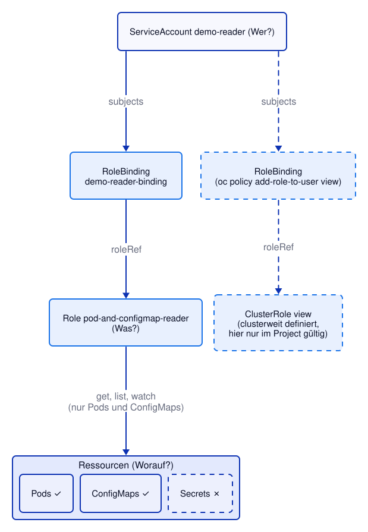

# Kapitel 11: Kubernetes RBAC
<!-- level: rookie -->

RBAC (Role-Based Access Control) regelt, wer welche Aktionen auf welchen
Ressourcen ausführen darf – sowohl für Menschen als auch für
Anwendungen (via ServiceAccounts). Dieses Kapitel lässt sich vollständig im
eigenen Project durchspielen, da Project-Owner dort selbst RBAC-Objekte
anlegen dürfen, ohne Cluster-Admin zu sein.

## Grundbegriffe

| Objekt              | Bedeutung                                                                 |
|----------------------|----------------------------------------------------------------------------|
| `ServiceAccount`     | Identität für Anwendungen/Pods (kein Mensch)                              |
| `Role`               | Erlaubnisse (`verbs` auf `resources`) **innerhalb eines Namespace/Project** |
| `ClusterRole`        | Wie `Role`, aber clusterweit gültig (oder für clusterweite Ressourcen)     |
| `RoleBinding`        | Verknüpft Subjects (User/Group/ServiceAccount) mit einer Role **in einem Namespace** |
| `ClusterRoleBinding`  | Verknüpft Subjects clusterweit mit einer ClusterRole                       |

Wichtig: Eine `ClusterRole` kann auch über eine `RoleBinding` (statt
`ClusterRoleBinding`) gebunden werden – dann gelten die Rechte nur innerhalb
des Namespace der Bindung. Das ist ein gängiges Muster, um eine Menge
vordefinierter ClusterRoles (z. B. `view`, `edit`, `admin`) wiederzuverwenden,
ohne sie clusterweit zu vergeben.

## Subjects

Ein RoleBinding/ClusterRoleBinding kann an drei Arten von Subjects binden:

- `User` – ein menschlicher Benutzer (z. B. via OAuth/OpenShift-Identity)
- `Group` – eine Gruppe von Usern
- `ServiceAccount` – eine Identität für Anwendungen, immer an ein Namespace/Project gebunden

## Beispiel in diesem Kapitel



`serviceaccount.yaml` legt eine ServiceAccount `demo-reader` an.
`role.yaml` definiert eine Role, die nur lesenden Zugriff auf Pods und
ConfigMaps erlaubt:

```yaml
rules:
  - apiGroups: [""]
    resources: ["pods", "configmaps"]
    verbs: ["get", "list", "watch"]
```

`rolebinding.yaml` verknüpft beide. Anwenden und testen:

```bash
oc apply -f 11-rbac/serviceaccount.yaml
oc apply -f 11-rbac/role.yaml
oc apply -f 11-rbac/rolebinding.yaml

# Darf die ServiceAccount Pods lesen?
oc auth can-i get pods --as=system:serviceaccount:$(oc project -q):demo-reader

# Darf sie Pods löschen? → "no" (Exit-Code 1, Fehler erwartet)
oc auth can-i delete pods --as=system:serviceaccount:$(oc project -q):demo-reader   # → no (Fehler erwartet)

# Darf sie Secrets lesen? → "no", da nicht in der Role enthalten
oc auth can-i get secrets --as=system:serviceaccount:$(oc project -q):demo-reader   # → no (Fehler erwartet)
```

## Aggregierte ClusterRoles

OpenShift/Kubernetes bringen vordefinierte ClusterRoles mit (`view`, `edit`,
`admin`, `cluster-admin`), die teils über **Aggregation**
(`aggregationRule` mit Label-Selektoren) automatisch um Regeln aus anderen
ClusterRoles erweitert werden – so können auch Operatoren/CRDs ihre eigenen
Ressourcen in die Standard-Rollen "einhängen", ohne dass die Standard-Rollen
manuell angepasst werden müssen.

## oc-Kurzform vs. Manifest

OpenShift bietet mit `oc policy add-role-to-user` eine Kurzform, die Role und
RoleBinding in einem Schritt erledigt:

```bash
# Vordefinierte ClusterRole "view" per RoleBinding im eigenen Project vergeben
oc policy add-role-to-user view -z demo-reader
oc get rolebindings

# Jetzt darf die ServiceAccount auch z. B. Deployments lesen
oc auth can-i list deployments --as=system:serviceaccount:$(oc project -q):demo-reader

# Wieder entfernen
oc policy remove-role-from-user view -z demo-reader
```

Für reproduzierbare, versionierte Setups (GitOps) ist das explizite Manifest
(wie in diesem Kapitel) jedoch vorzuziehen – der `oc`-Befehl eignet sich vor
allem für schnelles, interaktives Ausprobieren.

## Manifeste in diesem Kapitel

- `serviceaccount.yaml` – ServiceAccount `demo-reader`
- `role.yaml` – Role mit lesenden Rechten auf Pods/ConfigMaps
- `rolebinding.yaml` – verknüpft ServiceAccount und Role

---

## Weiterführende Links

- [Kubernetes: RBAC](https://kubernetes.io/docs/reference/access-authn-authz/rbac/)
- [Kubernetes: ServiceAccounts](https://kubernetes.io/docs/concepts/security/service-accounts/)
- [OpenShift 4.22: Authentication and Authorization](https://docs.redhat.com/en/documentation/openshift_container_platform/4.22/html/authentication_and_authorization/index)
- [OpenShift 4.22: RBAC APIs](https://docs.redhat.com/en/documentation/openshift_container_platform/4.22/html/rbac_apis/index)

Siehe auch [99-anhang/DOCUMENTATION.md](../99-anhang/DOCUMENTATION.md) für die vollständige Liste.
