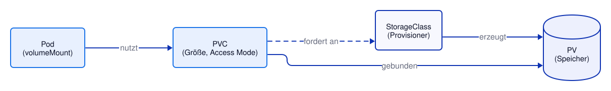
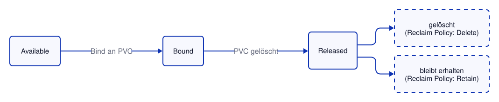

# Kapitel 15: Persistent Storage
<!-- level: advanced -->

Container-Dateisysteme sind flüchtig: Wird ein Container neu gestartet, sind
alle darin geschriebenen Daten weg. Für alles, was das überdauern soll
(Datenbanken, Uploads, ...), braucht es **PersistentVolumes (PV)** und
**PersistentVolumeClaims (PVC)**.

## Zusammenspiel PVC / PV / StorageClass



- Eine **PVC** ist eine *Anfrage* nach Speicher (Größe, Access Mode) –
  gestellt vom Anwendungsentwickler, ohne Details über die tatsächliche
  Storage-Infrastruktur zu kennen.
- Ein **PV** ist der *tatsächliche* Speicher (z. B. ein Cloud-Volume).
- Eine **StorageClass** definiert einen Auto-Provisioner, der bei Bedarf
  automatisch ein passendes PV erzeugt und mit der PVC verbindet – ohne
  StorageClass müsste ein Admin PVs manuell vorab anlegen.

```bash
oc get storageclass
# Die Default-StorageClass ist an der Annotation erkennbar:
#   storageclass.kubernetes.io/is-default-class: "true"

# PVC und Deployment anlegen, das die PVC verwendet
oc apply -f 15-storage/pvc.yaml
oc apply -f 15-storage/deployment-with-pvc.yaml
oc rollout status deployment/demo
oc get pvc demo-data
```

Wird in der PVC kein `storageClassName` angegeben (wie in `pvc.yaml`), wird
automatisch die Default-StorageClass des Clusters verwendet.

## Access Modes

| Modus | Bedeutung |
|--------|-----------------------------------------------------------|
| RWO  | ReadWriteOnce – von **einem Node** lesend/schreibend nutzbar |
| RWOP | ReadWriteOncePod – von **einem einzigen Pod** lesend/schreibend nutzbar |
| ROX  | ReadOnlyMany – von mehreren Nodes gleichzeitig, nur lesend |
| RWX  | ReadWriteMany – von mehreren Nodes gleichzeitig, lesend/schreibend |

Welche Modi ein Volume unterstützt, hängt vom zugrunde liegenden
Storage-Typ ab – klassischer Block-Storage (z. B. die meisten
Cloud-Disks) unterstützt in der Regel nur RWO und RWOP.

### RWO vs. RWOP

**RWO** beschränkt ein Volume auf **einen Node** – nicht auf einen Pod. Landen zwei Pods auf
demselben Node, dürfen beide gleichzeitig schreiben. Ob das passiert, entscheidet der
Scheduler; für eine Anwendung, die exklusiven Zugriff braucht (z. B. eine Datenbank mit
eigener Sperrdatei), ist das ein Risiko.

**RWOP** (`ReadWriteOncePod`) garantiert, dass **genau ein Pod** im ganzen Cluster das Volume
nutzt. Ein zweiter Pod wird gar nicht erst gestartet, sondern bleibt `Pending`. RWOP setzt
einen CSI-Treiber voraus, der den Modus unterstützt (die meisten aktuellen tun das).

```bash
oc apply -f 15-storage/pvc-rwop.yaml
oc apply -f 15-storage/deployment-rwop.yaml

# Ein Pod läuft, der zweite bleibt Pending
oc wait --for=jsonpath='{.status.readyReplicas}'=1 deployment/demo-rwop --timeout=120s
oc get pods -l volume=rwop

# Grund im Event des wartenden Pods:
# "... PersistentVolumeClaim with ReadWriteOncePod access mode already in-use by another pod"
POD=$(oc get pods -l volume=rwop --field-selector=status.phase=Pending -o jsonpath='{.items[0].metadata.name}')
oc describe pod "$POD" | grep -i ReadWriteOncePod

# Aufräumen
oc delete -f 15-storage/deployment-rwop.yaml
oc delete -f 15-storage/pvc-rwop.yaml
```

## PV-Lifecycle



Die **Reclaim Policy** des PV bestimmt, was nach dem Löschen der PVC
passiert:

- `Delete` – PV und zugrunde liegender Speicher werden automatisch gelöscht
  (Standard bei den meisten dynamisch provisionierten StorageClasses).
- `Retain` – PV bleibt im Zustand `Released` erhalten, muss manuell
  aufgeräumt oder wiederverwendet werden (schützt vor versehentlichem
  Datenverlust).

```bash
# Name des gebundenen PV
oc get pvc demo-data -o jsonpath='{.spec.volumeName}{"\n"}'

oc get pv   # ❗ benötigt Leserechte auf Cluster-Ebene
```

## Resizing

Unterstützt die StorageClass `allowVolumeExpansion: true`, lässt sich eine
PVC **vergrößern**, ohne sie neu anzulegen:

```bash
oc patch pvc demo-data -p '{"spec":{"resources":{"requests":{"storage":"2Gi"}}}}'
oc get pvc demo-data -w
```

Wichtig: Eine Verkleinerung ist nicht möglich – nur eine Vergrößerung.
Je nach Storage-Backend muss der Pod, der die PVC verwendet, für die
Dateisystem-Vergrößerung neu gestartet werden.

## Snapshots

`VolumeSnapshot`/`VolumeSnapshotClass` erlauben es, einen Zeitpunkt-Zustand
eines Volumes zu sichern und später als Basis für ein neues Volume zu
verwenden. `cluster-specific/volumesnapshot.yaml` zeigt das Prinzip:

```yaml
spec:
  source:
    persistentVolumeClaimName: demo-data
  # volumeSnapshotClassName: ...   ohne Angabe: Default-VolumeSnapshotClass des Clusters
```

Snapshots setzen voraus, dass der CSI-Treiber des Clusters Snapshots unterstützt und eine
`VolumeSnapshotClass` existiert – prüfen mit:

```bash
oc get volumesnapshotclass
```

❗ Nur auf Clustern mit (Default-)VolumeSnapshotClass (die Developer Sandbox hat eine):

```bash
oc apply -f 15-storage/cluster-specific/volumesnapshot.yaml
oc wait --for=jsonpath='{.status.readyToUse}'=true volumesnapshot/demo-data-snapshot --timeout=300s
oc get volumesnapshot demo-data-snapshot
```

Ein neues Volume aus dem Snapshot entsteht über `dataSource` in einer PVC:

```yaml
spec:
  dataSource:
    name: demo-data-snapshot
    kind: VolumeSnapshot
    apiGroup: snapshot.storage.k8s.io
```

## Geteiltes Volume (RWX)

Soll ein Deployment mit mehreren Replicas **dasselbe** Volume nutzen (z. B. gemeinsame
HTML-Dateien), braucht es den Access Mode `ReadWriteMany`. Ob das geht, hängt von der
StorageClass ab:

```bash
oc get storageclass
```

❗ Nur auf Clustern mit RWX-fähiger StorageClass (vorher `storageClassName` in
`cluster-specific/pvc-rwx.yaml` anpassen):

```bash
oc apply -f 15-storage/cluster-specific/pvc-rwx.yaml
oc apply -f 15-storage/cluster-specific/deployment-rwx.yaml
oc get pods -l app=demo -o wide   # Pods auf verschiedenen Nodes, gleiches Volume
```

## Beispiel-Deployment mit PVC

`deployment-with-pvc.yaml` mountet die PVC aus `pvc.yaml` unter
`/var/demo/data`. Die Update-Strategie ist bewusst auf `Recreate` gesetzt,
da die meisten RWO-Volumes nicht gleichzeitig von zwei Pods (altem und
neuem, wie bei einem Rolling-Update) gemountet werden können.

```bash
# Deployment und PVC wurden bereits oben angelegt:
oc get deployment demo
oc get pvc demo-data

# Daten schreiben, Pod löschen – die Daten überleben
oc exec deploy/demo -- sh -c 'date > /var/demo/data/test.txt'
oc delete pod -l app=demo --wait
oc rollout status deployment/demo
oc exec deploy/demo -- cat /var/demo/data/test.txt
```

## Manifeste in diesem Kapitel

- `pvc.yaml` – PersistentVolumeClaim ohne feste StorageClass (nutzt Cluster-Default)
- `pvc-rwop.yaml`, `deployment-rwop.yaml` – Volume mit `ReadWriteOncePod`, das zwei Replicas nutzen wollen
- `deployment-with-pvc.yaml` – Deployment, das die PVC mountet
- ❗ `cluster-specific/volumesnapshot.yaml` – Referenz-Snapshot (abhängig vom CSI-Treiber des Clusters)
- ❗ `cluster-specific/pvc-rwx.yaml`, `cluster-specific/deployment-rwx.yaml` – geteiltes RWX-Volume für 3 Replicas
  (benötigt eine StorageClass mit `ReadWriteMany`, z. B. EFS/CephFS – `storageClassName` anpassen)

---

## Weiterführende Links

- [Kubernetes: Persistent Volumes](https://kubernetes.io/docs/concepts/storage/persistent-volumes/)
- [Kubernetes: StorageClasses](https://kubernetes.io/docs/concepts/storage/storage-classes/)
- [Kubernetes: Volume-Snapshots](https://kubernetes.io/docs/concepts/storage/volume-snapshots/)
- [OpenShift 4.22: Storage](https://docs.redhat.com/en/documentation/openshift_container_platform/4.22/html/storage/index)

Siehe auch [99-anhang/DOCUMENTATION.md](../99-anhang/DOCUMENTATION.md) für die vollständige Liste.
