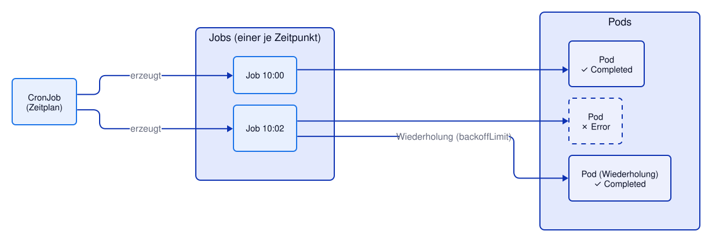

# Kapitel 17: Jobs und CronJobs
<!-- level: advanced -->

Deployments sind für Anwendungen gedacht, die **dauerhaft laufen**. Viele Aufgaben sind aber
nach getaner Arbeit fertig: eine Datenmigration, ein Export, ein nächtlicher Bericht, ein
regelmäßiger Health-Check. Dafür gibt es **Jobs** (einmalig) und **CronJobs** (nach Zeitplan).

| | Deployment | Job | CronJob |
|---|---|---|---|
| Läuft | dauerhaft | bis zum Erfolg | nach Zeitplan, jeweils bis zum Erfolg |
| Pod beendet sich | wird neu gestartet | gilt als erledigt (`Completed`) | gilt als erledigt |
| `restartPolicy` | `Always` | `Never` oder `OnFailure` | `Never` oder `OnFailure` |



## Vorbereitung

Die Jobs in diesem Kapitel prüfen die Demo-App über ihren Health-Endpunkt (siehe Kapitel 10):

```bash
oc apply -f 10-health-quotas/deployment-with-probes.yaml
oc apply -f 10-health-quotas/service.yaml
oc rollout status deployment/demo
```

---

## Jobs

`job.yaml` startet drei Pods, die jeweils den Health-Endpunkt der Demo-App abfragen:

```yaml
spec:
  completions: 3              # Job ist fertig, wenn 3 Pods erfolgreich waren
  parallelism: 3              # ... die gleichzeitig laufen dürfen
  backoffLimit: 2             # höchstens 2 Wiederholungen bei Fehlern
  activeDeadlineSeconds: 120  # spätestens nach 2 Minuten abbrechen
  ttlSecondsAfterFinished: 600  # 10 Minuten nach Ende automatisch löschen
  template:
    spec:
      restartPolicy: Never
```

```bash
oc apply -f 17-jobs/job.yaml

# Warten, bis der Job fertig ist
oc wait --for=condition=complete job/demo-check --timeout=180s

# Status: COMPLETIONS 3/3
oc get jobs

# Die Pods eines Jobs tragen das Label job-name
oc get pods -l job-name=demo-check

# Ausgabe (eines) der Pods
oc logs job/demo-check
```

Die Pods bleiben nach dem Ende im Status `Completed` stehen, damit man die Logs noch lesen
kann. Aufgeräumt wird über `ttlSecondsAfterFinished` – oder von Hand:

```bash
oc delete job demo-check     # löscht auch die zugehörigen Pods
```

> **Label der Job-Pods:** Die Pods tragen bewusst das Label `app: demo-job` und **nicht**
> `app: demo`. Sonst würde der Service `demo` auch Anfragen an die Job-Pods weiterleiten,
> die gar keinen Webserver enthalten.

### Fehlschläge und Wiederholungen

`job-failing.yaml` fragt eine Seite ab, die es nicht gibt. Mit `restartPolicy: Never` startet
Kubernetes für jeden neuen Versuch einen **neuen Pod** (mit wachsender Wartezeit
dazwischen: 10 s, 20 s, 40 s …), bis `backoffLimit` erreicht ist:

```bash
oc apply -f 17-jobs/job-failing.yaml
oc wait --for=condition=failed job/demo-check-failing --timeout=180s

# Anzahl fehlgeschlagener Versuche: 3 (der erste Versuch + 2 Wiederholungen)
oc get job demo-check-failing -o jsonpath='{.status.failed}{"\n"}'

# Für jeden Versuch ein Pod im Status Error
oc get pods -l job-name=demo-check-failing

# Grund steht im Status des Jobs: BackoffLimitExceeded
oc get job demo-check-failing -o jsonpath='{.status.conditions[?(@.type=="Failed")].reason}{"\n"}'
```

Mit `restartPolicy: OnFailure` würde stattdessen der Container im **selben** Pod neu gestartet
– weniger Pods, aber die Logs früherer Versuche sind nur noch über `oc logs --previous` zu sehen.

---

## CronJobs

Ein CronJob erzeugt nach einem Zeitplan (Cron-Syntax, Zeitzone UTC) jeweils einen neuen Job:

```yaml
spec:
  schedule: "*/2 * * * *"          # alle 2 Minuten
  concurrencyPolicy: Forbid        # kein neuer Lauf, solange der vorige noch läuft
  successfulJobsHistoryLimit: 3    # die letzten 3 erfolgreichen Jobs aufbewahren
  failedJobsHistoryLimit: 1
```

| `concurrencyPolicy` | Verhalten, wenn der vorige Lauf noch nicht fertig ist |
|---|---|
| `Allow` (Default) | neuer Job läuft parallel |
| `Forbid` | neuer Lauf wird übersprungen |
| `Replace` | alter Job wird abgebrochen, neuer startet |

```bash
oc apply -f 17-jobs/cronjob.yaml
oc get cronjobs

# Nicht auf den Zeitplan warten: einen Job aus dem CronJob von Hand erzeugen
oc create job demo-health-manual --from=cronjob/demo-health
oc wait --for=condition=complete job/demo-health-manual --timeout=120s
oc logs job/demo-health-manual

# Nach einigen Minuten: die vom Zeitplan erzeugten Jobs
oc get jobs --sort-by=.metadata.creationTimestamp

# CronJob anhalten (z. B. während einer Wartung) und wieder aktivieren
oc patch cronjob demo-health -p '{"spec":{"suspend":true}}'
oc get cronjob demo-health
oc patch cronjob demo-health -p '{"spec":{"suspend":false}}'
```

---

## Manifeste in diesem Kapitel

- `job.yaml` – Job mit 3 parallelen Pods, die den Health-Endpunkt abfragen
- `job-failing.yaml` – Job, der fehlschlägt (Wiederholungen, `backoffLimit`)
- `cronjob.yaml` – CronJob, der alle 2 Minuten einen Health-Check ausführt

---

## Weiterführende Links

- [Kubernetes: Jobs](https://kubernetes.io/docs/concepts/workloads/controllers/job/)
- [Kubernetes: CronJobs](https://kubernetes.io/docs/concepts/workloads/controllers/cron-jobs/)
- [OpenShift 4.22: Nodes – Jobs und CronJobs](https://docs.redhat.com/en/documentation/openshift_container_platform/4.22/html/nodes/index)

Siehe auch [99-anhang/DOCUMENTATION.md](../99-anhang/DOCUMENTATION.md) für die vollständige Liste.
