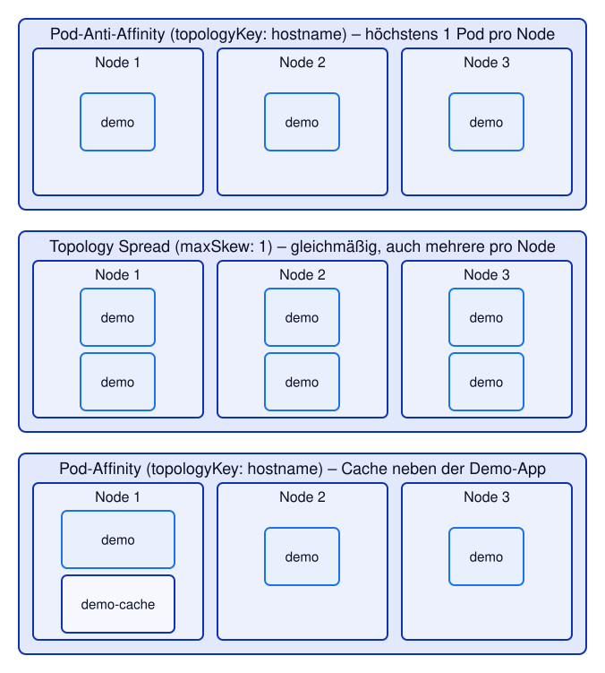

# Kapitel 18: Scheduling – Affinity, Anti-Affinity und Topology Spread
<!-- level: advanced -->

Der **Scheduler** entscheidet, auf welchem Node ein Pod läuft. Ohne weitere Angaben wählt er
irgendeinen Node mit genug freien Ressourcen (Kapitel 8). Oft soll das gezielter passieren:

- **Node Affinity:** nur auf bestimmten Nodes (z. B. bestimmte Prozessor-Architektur, Zone, GPU)
- **Pod Affinity:** in der Nähe anderer Pods (z. B. Cache neben der Anwendung)
- **Pod Anti-Affinity:** getrennt von anderen Pods (z. B. Replicas auf verschiedenen Nodes)
- **Topology Spread Constraints:** gleichmäßig verteilt über Nodes oder Zonen



---

## Node-Labels

Alle Regeln beziehen sich auf **Labels der Nodes**. Einige setzt Kubernetes bzw. der
Cloud-Provider automatisch:

| Label | Beispiel | Bedeutung |
|---|---|---|
| `kubernetes.io/hostname` | `ip-10-0-4-73.ec2.internal` | ein einzelner Node |
| `topology.kubernetes.io/zone` | `us-east-1a` | Availability Zone (Rechenzentrum) |
| `topology.kubernetes.io/region` | `us-east-1` | Region |
| `kubernetes.io/arch` | `amd64`, `arm64` | Prozessor-Architektur |
| `kubernetes.io/os` | `linux` | Betriebssystem |

❗ Nodes und ihre Labels ansehen erfordert Leserechte auf Cluster-Ebene (z. B. nicht in der
Developer Sandbox):

```bash
oc get nodes -L topology.kubernetes.io/zone,kubernetes.io/arch
```

Ohne diese Rechte sieht man immerhin, **auf welchem** Node ein Pod läuft – Spalte `NODE` bzw.
das Feld `spec.nodeName`. Darüber prüfen wir in diesem Kapitel die Platzierung.

Die einfachste Form der Steuerung ist `nodeSelector` – der Pod läuft nur auf Nodes, die
**alle** angegebenen Labels haben:

```yaml
spec:
  nodeSelector:
    kubernetes.io/arch: amd64
```

---

## Node Affinity

Node Affinity ist die ausdrucksstärkere Variante von `nodeSelector`: mit Operatoren (`In`,
`NotIn`, `Exists`, `Gt`, …) und als **harte** oder **weiche** Regel:

```yaml
affinity:
  nodeAffinity:
    # hart: Pod läuft nur, wenn die Regel erfüllt ist
    requiredDuringSchedulingIgnoredDuringExecution:
      nodeSelectorTerms:
        - matchExpressions:
            - key: kubernetes.io/arch
              operator: In
              values: ["amd64", "arm64"]
    # weich: wenn möglich, sonst egal (weight 1–100 gewichtet mehrere Präferenzen)
    preferredDuringSchedulingIgnoredDuringExecution:
      - weight: 50
        preference:
          matchExpressions:
            - key: topology.kubernetes.io/zone
              operator: In
              values: ["us-east-1a"]
```

`…IgnoredDuringExecution` bedeutet: Die Regel gilt **beim Einplanen**. Ändern sich später die
Labels eines Nodes, laufen bereits gestartete Pods weiter.

```bash
oc apply -f 18-scheduling/node-affinity.yaml
oc rollout status deployment/demo
oc get pods -l app=demo -o wide
```

Eine harte Regel, die kein Node erfüllt, führt zu einem Pod, der **für immer** `Pending`
bleibt:

```bash
oc apply -f 18-scheduling/node-affinity-unmoeglich.yaml
oc wait --for=jsonpath='{.status.conditions[?(@.type=="PodScheduled")].reason}'=Unschedulable pod/demo-unmoeglich --timeout=60s

# STATUS Pending; im Event: "didn't match Pod's node affinity/selector"
oc get pod demo-unmoeglich
oc describe pod demo-unmoeglich | grep -i 'node affinity'

oc delete pod demo-unmoeglich
```

---

## Pod Anti-Affinity: Replicas trennen

Drei Replicas helfen wenig, wenn alle auf **demselben** Node laufen und genau dieser ausfällt.
Pod Anti-Affinity verbietet, dass zwei Pods mit passendem Label in derselben **Topologie**
landen – welche das ist, bestimmt `topologyKey`:

```yaml
affinity:
  podAntiAffinity:
    requiredDuringSchedulingIgnoredDuringExecution:
      - labelSelector:
          matchLabels:
            app: demo
        topologyKey: kubernetes.io/hostname    # oder topology.kubernetes.io/zone
```

```bash
# Neu anlegen, damit keine alten Pods (noch im Beenden) die Zählung verfälschen
oc delete deployment demo --ignore-not-found
oc wait --for=delete pod -l app=demo --timeout=120s
oc apply -f 18-scheduling/pod-anti-affinity.yaml
oc rollout status deployment/demo

# Auf welchen Nodes laufen die Pods? Jeder Node genau einmal (Zähler 1)
oc get pods -l app=demo -o jsonpath='{range .items[*]}{.spec.nodeName}{"\n"}{end}' | sort | uniq -c

# Kontrolle: kein Node doppelt – uniq -d findet nichts, grep endet mit Exit-Code 1
oc get pods -l app=demo -o jsonpath='{range .items[*]}{.spec.nodeName}{"\n"}{end}' | sort | uniq -d | grep .   # → keine Ausgabe (Fehler erwartet)
```

> **Achtung:** Mit einer **harten** Anti-Affinity können nie mehr Replicas laufen, als es
> Nodes (bzw. Zonen) gibt – weitere Pods bleiben `Pending`. Für "möglichst verteilt" ist
> `preferredDuringScheduling…` oder Topology Spread (unten) meist die bessere Wahl.

---

## Pod Affinity: Pods zusammen platzieren

Umgekehrt kann ein Pod **in der Nähe** anderer Pods laufen sollen – z. B. ein Cache, der mit
geringer Latenz von der Anwendung erreichbar sein soll. `pod-affinity.yaml` startet einen
"Cache" auf einem Node, auf dem auch ein Pod mit `app=demo` läuft:

```yaml
affinity:
  podAffinity:
    requiredDuringSchedulingIgnoredDuringExecution:
      - labelSelector:
          matchLabels:
            app: demo
        topologyKey: kubernetes.io/hostname
```

```bash
oc apply -f 18-scheduling/pod-affinity.yaml
oc rollout status deployment/demo-cache

CACHE_NODE=$(oc get pod -l app=demo-cache -o jsonpath='{.items[0].spec.nodeName}')
echo "Cache läuft auf $CACHE_NODE"

# Auf diesem Node läuft auch ein Pod der Demo-App
oc get pods -l app=demo -o wide | grep "$CACHE_NODE"

oc delete deployment demo-cache
```

> Pod (Anti-)Affinity ist für den Scheduler aufwendig zu berechnen. In sehr großen Clustern
> (tausende Nodes) wird sie deshalb sparsam eingesetzt.

---

## Topology Spread Constraints

Anti-Affinity kennt nur "höchstens einer pro Topologie". **Topology Spread Constraints**
verteilen dagegen **gleichmäßig** – auch wenn es mehr Pods als Nodes oder Zonen gibt:

```yaml
topologySpreadConstraints:
  - maxSkew: 1                                # max. 1 Pod Unterschied zwischen den Zonen
    topologyKey: topology.kubernetes.io/zone
    whenUnsatisfiable: DoNotSchedule          # harte Regel
    nodeTaintsPolicy: Honor                   # Zonen mit nur gesperrten Nodes nicht mitzählen
    labelSelector:
      matchLabels:
        app: demo
  - maxSkew: 1                                # innerhalb der Zonen möglichst auf verschiedene Nodes
    topologyKey: kubernetes.io/hostname
    whenUnsatisfiable: ScheduleAnyway         # weiche Regel
    labelSelector:
      matchLabels:
        app: demo
```

| Feld | Bedeutung |
|---|---|
| `maxSkew` | erlaubter Unterschied der Pod-Anzahl zwischen der vollsten und der leersten Topologie |
| `topologyKey` | Node-Label, das die Topologien bildet (Node, Zone, Region …) |
| `whenUnsatisfiable` | `DoNotSchedule` (hart: lieber `Pending`) oder `ScheduleAnyway` (weich) |
| `nodeTaintsPolicy` | `Honor`: Nodes, auf denen der Pod wegen Taints nicht laufen darf, zählen nicht mit |

```bash
oc delete deployment demo
oc wait --for=delete pod -l app=demo --timeout=120s
oc apply -f 18-scheduling/topology-spread.yaml
oc rollout status deployment/demo

# 6 Pods, möglichst gleichmäßig auf die Nodes verteilt
oc get pods -l app=demo -o jsonpath='{range .items[*]}{.spec.nodeName}{"\n"}{end}' | sort | uniq -c
```

| | Pod Anti-Affinity | Topology Spread |
|---|---|---|
| Ziel | Pods **trennen** | Pods **gleichmäßig verteilen** |
| Mehr Pods als Nodes/Zonen | weitere Pods `Pending` (hart) | kein Problem |
| Typischer Einsatz | "nie zwei Instanzen auf einem Node" | Hochverfügbarkeit über Zonen |

Für die Verteilung von Replicas ist Topology Spread heute meist die erste Wahl.

---

## Ausblick: Taints und Tolerations

Affinity zieht Pods **zu** Nodes hin. **Taints** wirken umgekehrt: Ein Node mit Taint
(z. B. `node-role.kubernetes.io/infra:NoSchedule`) **weist** alle Pods ab, die keine passende
**Toleration** haben. So reserviert die Cluster-Administration Nodes für bestimmte Aufgaben
(Infrastruktur, GPUs). In den Scheduling-Events sieht man das als
`node(s) had untolerated taint(s)`. Taints setzen erfordert Cluster-Admin-Rechte.

```yaml
# Toleration im Pod: darf auf Nodes mit diesem Taint laufen (muss aber nicht)
tolerations:
  - key: node-role.kubernetes.io/infra
    operator: Exists
    effect: NoSchedule
```

---

## Manifeste in diesem Kapitel

- `node-affinity.yaml` – Deployment mit harter und weicher Node Affinity
- `node-affinity-unmoeglich.yaml` – Pod mit unerfüllbarer Node Affinity (bleibt `Pending`)
- `pod-anti-affinity.yaml` – Deployment mit 3 Replicas auf verschiedenen Nodes
- `pod-affinity.yaml` – "Cache", der auf demselben Node wie die Demo-App läuft
- `topology-spread.yaml` – Deployment mit 6 Replicas, gleichmäßig über Zonen und Nodes verteilt

---

## Weiterführende Links

- [Kubernetes: Assigning Pods to Nodes (Affinity)](https://kubernetes.io/docs/concepts/scheduling-eviction/assign-pod-node/)
- [Kubernetes: Pod Topology Spread Constraints](https://kubernetes.io/docs/concepts/scheduling-eviction/topology-spread-constraints/)
- [Kubernetes: Taints and Tolerations](https://kubernetes.io/docs/concepts/scheduling-eviction/taint-and-toleration/)
- [Kubernetes: Well-Known Labels](https://kubernetes.io/docs/reference/labels-annotations-taints/)
- [OpenShift 4.22: Nodes – Controlling pod placement](https://docs.redhat.com/en/documentation/openshift_container_platform/4.22/html/nodes/index)

Siehe auch [99-anhang/DOCUMENTATION.md](../99-anhang/DOCUMENTATION.md) für die vollständige Liste.
