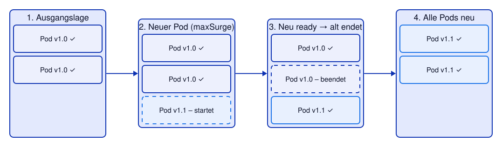
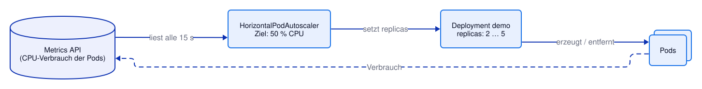

# Kapitel 19: Verfügbarkeit – Rolling Updates, PodDisruptionBudget, Autoscaling
<!-- level: advanced -->

Mit Probes (Kapitel 10) weiß Kubernetes, ob ein Pod Anfragen annehmen kann. Dieses Kapitel
zeigt, wie man darauf aufbauend **Updates ohne Ausfall** durchführt, Pods bei Wartungsarbeiten
schützt und eine Anwendung **automatisch skaliert**.

Alle Manifeste liegen in diesem Kapitel; `deployment.yaml` enthält bereits Probes,
Requests/Limits und die hier besprochenen Einstellungen.

```bash
oc apply -f 19-availability/deployment.yaml
oc apply -f 19-availability/service.yaml
oc rollout status deployment/demo
```

---

## Rolling Updates ohne Ausfall



```yaml
spec:
  minReadySeconds: 5          # neuer Pod muss 5 s "ready" sein, bevor es weitergeht
  strategy:
    type: RollingUpdate
    rollingUpdate:
      maxSurge: 1             # höchstens 1 Pod mehr als gewünscht
      maxUnavailable: 0       # nie weniger Pods als gewünscht
```

Damit dabei wirklich **keine** Anfrage verloren geht, müssen drei Dinge zusammenpassen:

1. **Readiness-Probe:** Ein neuer Pod bekommt erst Traffic, wenn er bereit ist.
2. **`maxUnavailable: 0`:** Ein alter Pod wird erst beendet, wenn ein neuer bereit ist.
3. **`preStop`-Hook:** Beim Beenden wartet der Pod kurz, bis er aus allen Service-Endpoints
   entfernt ist – erst dann beendet sich die Anwendung.

```yaml
lifecycle:
  preStop:
    exec:
      command: ["sleep", "5"]
```

Ausprobieren: Ein "Watcher"-Pod fragt eine Minute lang jede Sekunde die Version der Demo-App
ab, während das Deployment von `1.0` auf `1.1` aktualisiert wird:

```bash
oc run watcher --image=quay.io/ghilling/ubi-tools:10-latest --restart=Never --labels=app=demo-job \
  -- sh -c 'for i in $(seq 1 60); do curl -sf http://demo:8080/info | grep -o "\"version\":\"[^\"]*\"" || echo FEHLER; sleep 1; done'
oc wait --for=condition=Ready pod/watcher --timeout=120s

# Update starten und abwarten
oc set image deployment/demo demo=quay.io/ghilling/quarkus-demo:1.1
oc rollout status deployment/demo

# Ergebnis: erst Version 1.0, dann 1.1 – und kein einziger Fehler
oc wait --for=jsonpath='{.status.phase}'=Succeeded pod/watcher --timeout=120s
oc logs watcher | sort | uniq -c

# Kontrolle: keine Zeile "FEHLER" – grep findet nichts und endet mit Exit-Code 1
oc logs watcher | grep FEHLER   # → keine Ausgabe (Fehler erwartet)
```

> Zum Vergleich: Ohne `preStop`-Hook und mit `maxUnavailable: 1` tauchen im Log meist
> einzelne `FEHLER`-Zeilen auf.

---

## PodDisruptionBudget

Neben Abstürzen gibt es **freiwillige Unterbrechungen**: Ein Admin wartet einen Node
(`oc adm drain`), der Cluster wird aktualisiert, Nodes werden verkleinert. Ein
**PodDisruptionBudget** (PDB) legt fest, wie viele Pods dabei mindestens laufen müssen:

```yaml
spec:
  minAvailable: 2
  selector:
    matchLabels:
      app: demo
```

```bash
oc apply -f 19-availability/pdb.yaml

# 2 Pods laufen, 2 müssen laufen → ALLOWED DISRUPTIONS 0
oc get pdb demo
```

Ein `oc adm drain` darf nur die Cluster-Administration ausführen – dieselbe Prüfung lässt sich
aber auch im eigenen Project beobachten, indem man einen Pod über die **Eviction-API**
"freiwillig" entfernen lässt (genau das macht `drain` für jeden Pod):

```bash
POD=$(oc get pod -l app=demo -o jsonpath='{.items[0].metadata.name}')
printf '{"apiVersion":"policy/v1","kind":"Eviction","metadata":{"name":"%s"}}' "$POD" > /tmp/eviction.json

# Abgelehnt: "Cannot evict pod as it would violate the pod's disruption budget"
oc create --raw "/api/v1/namespaces/$(oc project -q)/pods/$POD/eviction" -f /tmp/eviction.json   # (Fehler erwartet)

# Mit 3 Pods ist eine Unterbrechung erlaubt
oc scale deployment demo --replicas=3
oc rollout status deployment/demo
oc get pdb demo
oc create --raw "/api/v1/namespaces/$(oc project -q)/pods/$POD/eviction" -f /tmp/eviction.json

# Der Pod wurde beendet, das Deployment startet einen Ersatz
oc rollout status deployment/demo

# Zurück auf 2 Replicas für den nächsten Abschnitt
oc scale deployment demo --replicas=2
```

> `oc delete pod` umgeht das PDB – es gilt nur für die Eviction-API (Node-Wartung,
> Cluster-Updates, Autoscaler).

---

## Pods auf Nodes verteilen

Zwei Pods auf demselben Node helfen wenig, wenn genau dieser Node ausfällt. `deployment.yaml`
verteilt die Pods deshalb mit `topologySpreadConstraints` möglichst auf verschiedene Nodes –
Details und Alternativen (Pod Anti-Affinity) in Kapitel 18.

```bash
# Spalte NODE: die Pods laufen auf verschiedenen Nodes (sofern genug Nodes vorhanden sind)
oc get pods -l app=demo -o wide
```

---

## Horizontal Pod Autoscaler



Der **HorizontalPodAutoscaler** (HPA) passt `replicas` eines Deployments automatisch an die
Last an. Grundlage ist der **CPU-Request** (Kapitel 8): Bei `averageUtilization: 50` und
einem Request von `100m` skaliert der HPA hoch, sobald die Pods im Schnitt mehr als `50m`
verbrauchen.

```yaml
spec:
  minReplicas: 2
  maxReplicas: 5
  metrics:
    - type: Resource
      resource:
        name: cpu
        target:
          type: Utilization
          averageUtilization: 50
```

```bash
oc apply -f 19-availability/hpa.yaml
oc get hpa demo        # TARGETS zeigt nach ca. 1 Minute den aktuellen Verbrauch

# Last erzeugen: 3 Pods rufen die Demo-App einige Minuten lang in einer Schleife auf
oc apply -f 19-availability/load-job.yaml

# Beobachten (Abbruch mit Strg+C)
oc get hpa demo -w

# Ohne Beobachten: warten, bis der HPA mehr als 2 Replicas will (höchstens 5 Minuten)
for i in $(seq 1 30); do [ "$(oc get hpa demo -o jsonpath='{.status.desiredReplicas}')" -gt 2 ] && break; sleep 10; done
oc get hpa demo
oc get pods -l app=demo

# Last beenden – heruntergeskaliert wird erst nach 5 Minuten ohne Last (Stabilisierung)
oc delete job load
```

> **HPA und GitOps:** Sobald ein HPA die Replicas steuert, sollte das Feld `replicas` nicht
> mehr im Deployment-Manifest stehen – sonst setzt jedes `oc apply` den Wert zurück.

---

## Manifeste in diesem Kapitel

- `deployment.yaml` – Deployment mit Rolling-Update-Strategie, Probes, `preStop`-Hook und Topology Spread (Kapitel 18)
- `service.yaml` – Service für die Demo-App
- `pdb.yaml` – PodDisruptionBudget (`minAvailable: 2`)
- `hpa.yaml` – HorizontalPodAutoscaler (2–5 Replicas, 50 % CPU)
- `load-job.yaml` – Job, der Last auf der Demo-App erzeugt

---

## Weiterführende Links

- [Kubernetes: Deployments – Rolling Update](https://kubernetes.io/docs/concepts/workloads/controllers/deployment/#rolling-update-deployment)
- [Kubernetes: Pod Disruption Budgets](https://kubernetes.io/docs/concepts/workloads/pods/disruptions/)
- [Kubernetes: Pod Topology Spread Constraints](https://kubernetes.io/docs/concepts/scheduling-eviction/topology-spread-constraints/)
- [Kubernetes: Horizontal Pod Autoscaling](https://kubernetes.io/docs/tasks/run-application/horizontal-pod-autoscale/)
- [OpenShift 4.22: Nodes](https://docs.redhat.com/en/documentation/openshift_container_platform/4.22/html/nodes/index)

Siehe auch [99-anhang/DOCUMENTATION.md](../99-anhang/DOCUMENTATION.md) für die vollständige Liste.
