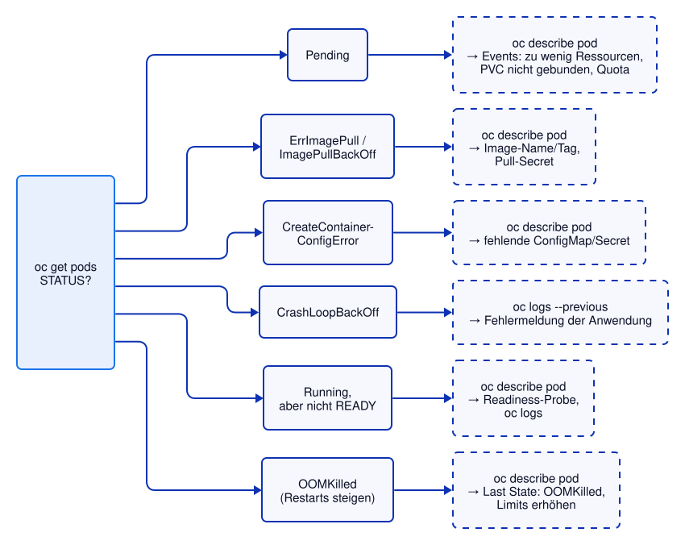

# Kapitel 20: Debugging und Observability
<!-- level: advanced -->

Kapitel 4 hat die wichtigsten Befehle zur Fehlersuche vorgestellt. In diesem Kapitel werden
typische Fehler **bewusst erzeugt** und Schritt für Schritt diagnostiziert. Danach geht es um
Werkzeuge, mit denen man in laufende oder abstürzende Pods hineinsehen kann.



> Die fehlerhaften Deployments tragen das Label `app: demo-debug` (nicht `app: demo`), damit
> sie den Service der Demo-App nicht stören. Am Ende des Kapitels werden sie wieder gelöscht.

---

## Fehlerbild 1: Image nicht gefunden

```bash
oc apply -f 20-debugging/fehler-image.yaml
oc wait --for=jsonpath='{.status.containerStatuses[0].state.waiting.reason}'=ImagePullBackOff pod -l fehler=image --timeout=120s

# STATUS: ErrImagePull bzw. ImagePullBackOff
oc get pods -l fehler=image

# Ursache steht in den Events am Ende von describe
oc describe pod -l fehler=image | tail -8
```

**Typische Ursachen:** Tippfehler in Image-Name oder Tag, Tag existiert (noch) nicht, privates
Repository ohne Pull-Secret, Registry vom Cluster aus nicht erreichbar.

---

## Fehlerbild 2: Anwendung stürzt ab

```bash
oc apply -f 20-debugging/fehler-crash.yaml
oc wait --for=jsonpath='{.status.containerStatuses[0].state.waiting.reason}'=CrashLoopBackOff pod -l fehler=crash --timeout=120s

# STATUS: CrashLoopBackOff, RESTARTS steigen
oc get pods -l fehler=crash

# Die Fehlermeldung steht im Log des letzten (abgestürzten) Containers
oc logs deployment/demo-fehler-crash --previous

# Exit-Code des letzten Laufs
oc get pod -l fehler=crash -o jsonpath='{.items[0].status.containerStatuses[0].lastState.terminated.exitCode}{"\n"}'
```

Zwischen den Neustarts wartet das kubelet immer länger (10 s, 20 s, 40 s … bis 5 Minuten) –
daher "BackOff".

### `oc debug`: den Pod mit einer Shell statt der Anwendung starten

Ein abstürzender Container lässt sich nicht mit `oc exec` untersuchen – er läuft ja nicht.
`oc debug` startet eine **Kopie** des Pods (gleiches Image, gleiche Umgebung, gleiche Volumes),
aber mit einer Shell statt des eigentlichen Befehls:

```bash
# Interaktiv: Shell in der Kopie (Beenden mit exit, die Kopie wird gelöscht)
oc debug deployment/demo-fehler-crash   # ❗ interaktiv

# Einzelne Befehle in der Kopie ausführen: Ist DB_URL gesetzt?
oc debug deployment/demo-fehler-crash -- sh -c 'echo "DB_URL=${DB_URL:-<nicht gesetzt>}"'
```

---

## Fehlerbild 3: ConfigMap fehlt

```bash
oc apply -f 20-debugging/fehler-config.yaml
oc wait --for=jsonpath='{.status.containerStatuses[0].state.waiting.reason}'=CreateContainerConfigError pod -l fehler=config --timeout=120s

# STATUS: CreateContainerConfigError – der Container wird gar nicht erst gestartet
oc get pods -l fehler=config
oc describe pod -l fehler=config | grep -i 'configmap'

# Behebung: ConfigMap anlegen – das kubelet startet den Container dann von selbst
oc create configmap datenbank-config --from-literal=url=jdbc:postgresql://db:5432/demo
oc label configmap datenbank-config app=demo-debug
oc wait --for=condition=Ready pod -l fehler=config --timeout=120s
oc get pods -l fehler=config
```

---

## Fehlerbild 4: Speicherlimit überschritten

```bash
oc apply -f 20-debugging/fehler-oom.yaml
oc wait --for=jsonpath='{.status.containerStatuses[0].lastState.terminated.reason}'=OOMKilled pod -l fehler=oom --timeout=120s

# RESTARTS steigen, STATUS wechselt zwischen OOMKilled, Running und CrashLoopBackOff
oc get pods -l fehler=oom

# "Last State: Terminated, Reason: OOMKilled, Exit Code: 137"
oc describe pod -l fehler=oom | grep -A4 'Last State'
```

Exit-Code **137** = 128 + 9 (SIGKILL): Der Kernel hat den Prozess beendet, weil der Container
sein Memory-Limit überschritten hat (Kapitel 8). Abhilfe: Limit erhöhen – oder bei Java die
Heap-Größe passend zum Limit einstellen.

---

## Werkzeuge

### Logs und Events

```bash
# Die Demo-App als "gesunde" Referenz
oc apply -f 05-automation/deployment.yaml
oc rollout status deployment/demo

# Logs aller Pods eines Deployments, mit Pod-Namen als Präfix
oc logs -l app=demo --prefix --tail=5

# Nur die Logs der letzten 10 Minuten
oc logs deployment/demo --since=10m

# Events des Projects, neueste zuletzt – oft der schnellste Weg zur Ursache
oc get events --sort-by=.lastTimestamp | tail -15

# Nur Warnungen
oc get events --field-selector type=Warning
```

### Debug-Image statt Anwendungs-Image

Produktions-Images enthalten oft kaum Werkzeuge (in der Demo-App gibt es z. B. kein `ps`).
`oc debug` kann die Kopie mit einem **anderen Image** starten – Umgebung und Volumes bleiben
gleich:

```bash
oc exec deployment/demo -- ps aux   # → "ps: command not found" (Fehler erwartet)

# Kopie mit Werkzeug-Image: ps funktioniert, der Hostname zeigt den Namen der Kopie (…-debug-…)
oc debug deployment/demo --image=quay.io/ghilling/ubi-tools:10-latest -- sh -c 'ps aux; echo "Hostname: $HOSTNAME"'
```

`ps` zeigt hier nur die Prozesse der Kopie – die laufende Anwendung sieht man so nicht.
Dafür gibt es Ephemeral Containers.

### Ephemeral Containers

Ein **Ephemeral Container** wird einem *laufenden* Pod nachträglich hinzugefügt – mit eigenem
Image, aber im selben Pod (gleiches Netzwerk, mit `--target` auch dieselben Prozesse). Anders
als bei `oc debug` untersucht man also den echten Pod, nicht eine Kopie.

❗ Benötigt das Recht `pods/ephemeralcontainers` (nicht in der Developer Sandbox):

```bash
POD=$(oc get pod -l app=demo -o jsonpath='{.items[0].metadata.name}')
kubectl debug -it "$POD" --image=quay.io/ghilling/ubi-tools:10-latest --target=demo --profile=restricted -- sh
```

### Metriken und Logs in der OpenShift-Console

In der Web-Console gibt es ohne weitere Werkzeuge:

- **Workloads → Pods → Pod → Metrics:** CPU, Speicher, Netzwerk des Pods
- **Workloads → Pods → Pod → Logs / Events:** wie `oc logs` bzw. Events
- **Observe → Dashboards / Metrics:** Auslastung des Projects, eigene PromQL-Abfragen
  (z. B. `container_memory_working_set_bytes{namespace="<project>"}`)
- **Observe → Alerts:** vom Cluster gemeldete Probleme

```bash
# Dieselben Zahlen auf der Kommandozeile
oc adm top pods   # ❗ Metriken erst ca. 1 Minute nach dem Pod-Start verfügbar
```

---

## Aufräumen

```bash
oc delete deployment,configmap -l app=demo-debug
```

---

## Manifeste in diesem Kapitel

- `fehler-image.yaml` – Deployment mit nicht existierendem Image-Tag
- `fehler-crash.yaml` – Deployment, dessen Container sofort mit Fehler endet
- `fehler-config.yaml` – Deployment, das eine fehlende ConfigMap referenziert
- `fehler-oom.yaml` – Deployment, das sein Memory-Limit überschreitet

---

## Weiterführende Links

- [Kubernetes: Debug Running Pods](https://kubernetes.io/docs/tasks/debug/debug-application/debug-running-pod/)
- [Kubernetes: Ephemeral Containers](https://kubernetes.io/docs/concepts/workloads/pods/ephemeral-containers/)
- [Kubernetes: Determine the Reason for Pod Failure](https://kubernetes.io/docs/tasks/debug/debug-application/determine-reason-pod-failure/)
- [OpenShift 4.22: Monitoring](https://docs.redhat.com/en/documentation/openshift_container_platform/4.22/html/monitoring/index)

Siehe auch [99-anhang/DOCUMENTATION.md](../99-anhang/DOCUMENTATION.md) für die vollständige Liste.
