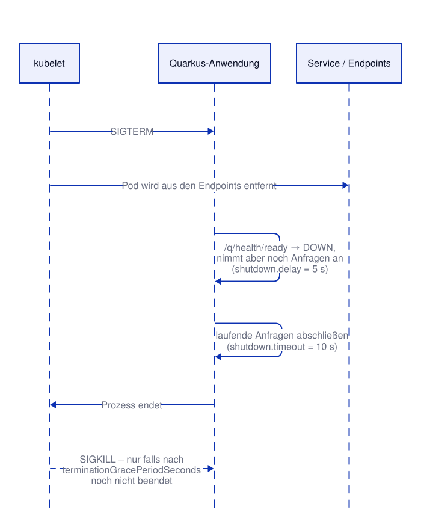

# Kapitel 21: Quarkus: Kurze Wiederholung
<!-- level: advanced -->

Die Demo-App ist eine [Quarkus](https://quarkus.io/)-Anwendung – Quarkus selbst ist bekannt.
Dieses Kapitel wiederholt kurz die Quarkus-Funktionen, die direkt mit der Plattform
zusammenspielen, und ordnet sie den vorherigen Kapiteln zu:

| Quarkus | Plattform | Kapitel |
|---|---|---|
| SmallRye Health (`/q/health/…`) | Startup-, Readiness-, Liveness-Probe | 10 |
| Konfigurationsquellen und -prioritäten | Umgebungsvariablen, ConfigMaps | 7, 13 |
| Graceful Shutdown | Rolling Updates ohne Ausfall | 19 |

> **Image-Tag `1.2`:** Die Health-Endpunkte von SmallRye Health kamen mit einer neuen Version
> der Demo-App. Dafür gibt es bewusst einen **neuen Tag** statt den bestehenden Tag `1.1` neu
> zu belegen: Ein Node, der `1.1` schon einmal geladen hat, verwendet sonst weiter die alte
> Version aus seinem Cache (`imagePullPolicy: IfNotPresent` ist der Default für alle Tags
> außer `latest`). Genau das Problem "Tags sind nicht unveränderlich" aus Kapitel 1.

```bash
oc apply -f 21-quarkus/configmap.yaml
oc apply -f 21-quarkus/deployment.yaml
oc apply -f 21-quarkus/service.yaml
oc rollout status deployment/demo
```

---

## Health-Checks mit SmallRye Health

In Kapitel 10 hat die Demo-App einen einzigen Endpunkt `/health` für alle Probes verwendet.
Mit der Extension `quarkus-smallrye-health` stellt Quarkus **getrennte** Endpunkte bereit –
passend zu den drei Probe-Typen:

| Endpunkt | Frage | Probe |
|---|---|---|
| `/q/health/started` | Ist die Anwendung hochgefahren? | `startupProbe` |
| `/q/health/ready` | Kann sie gerade Anfragen bearbeiten? (z. B. Datenbank erreichbar) | `readinessProbe` |
| `/q/health/live` | Läuft sie noch korrekt? (sonst Neustart) | `livenessProbe` |
| `/q/health` | alle Checks zusammen | – |

Eigene Checks sind kleine Klassen mit `@Readiness`, `@Liveness` oder `@Startup`. Die Demo-App
hat einen Readiness-Check, den `POST /admin/health/toggle` umschaltet
(`01-container/demo-app/src/main/java/de/hilling/demo/DemoReadinessCheck.java`):

```java
@Readiness
@ApplicationScoped
public class DemoReadinessCheck implements HealthCheck {
    @Inject
    HealthState state;

    @Override
    public HealthCheckResponse call() {
        return HealthCheckResponse.named("demo-app").status(state.isHealthy()).build();
    }
}
```

```bash
POD=$(oc get pod -l app=demo -o jsonpath='{.items[0].metadata.name}')

# Alle Checks mit Details
oc exec $POD -- curl -s http://localhost:8080/q/health

# Readiness auf DOWN setzen
oc exec $POD -- curl -s -X POST http://localhost:8080/admin/health/toggle
oc exec $POD -- curl -s -o /dev/null -w 'ready: %{http_code}\n' http://localhost:8080/q/health/ready
oc exec $POD -- curl -s -o /dev/null -w 'live:  %{http_code}\n' http://localhost:8080/q/health/live

# Der Pod wird "nicht bereit" (READY 0/1) – aber NICHT neu gestartet (RESTARTS 0),
# weil die Liveness weiterhin UP meldet
oc wait --for=condition=Ready=false pod/$POD --timeout=60s
oc get pods -l app=demo

# Wieder auf UP setzen
oc exec $POD -- curl -s -X POST http://localhost:8080/admin/health/toggle
oc wait --for=condition=Ready pod/$POD --timeout=60s
```

Genau diese Trennung ist der Punkt: Ein Pod, dessen Datenbank kurz nicht erreichbar ist,
soll keinen Traffic bekommen (Readiness) – ein Neustart (Liveness) würde aber nichts helfen.

---

## Konfiguration

Quarkus liest Konfiguration aus mehreren Quellen. Höhere Einträge überschreiben niedrigere:

| Priorität | Quelle | Beispiel |
|---|---|---|
| 1 | System-Properties | `java -Ddemo.message=… -jar …` |
| 2 | Umgebungsvariablen | `DEMO_MESSAGE=…` (Punkte/Bindestriche → `_`, Großbuchstaben) |
| 3 | `config/application.properties` im Arbeitsverzeichnis | per ConfigMap gemountet |
| 4 | `application.properties` im Image | Standardwerte der Anwendung |

Das Deployment mountet die ConfigMap `demo-config` als `/app/config/application.properties`
(das Arbeitsverzeichnis im Image ist `/app`):

```yaml
volumeMounts:
  - name: config
    mountPath: /app/config
volumes:
  - name: config
    configMap:
      name: demo-config
```

```bash
# Nachricht aus der ConfigMap
oc exec deploy/demo -- curl -s http://localhost:8080/info

# Umgebungsvariable hat Vorrang vor der Datei
oc set env deployment/demo DEMO_MESSAGE="Hallo aus der Umgebungsvariable"
oc rollout status deployment/demo
oc exec deploy/demo -- curl -s http://localhost:8080/info

# Variable wieder entfernen → wieder der Wert aus der ConfigMap
oc set env deployment/demo DEMO_MESSAGE-
oc rollout status deployment/demo
```

Quarkus liest die Konfiguration **beim Start**. Eine geänderte ConfigMap wird also erst nach
einem Neustart wirksam – entweder von Hand oder automatisch über einen
`configMapGenerator` mit Hash-Suffix (Kapitel 13):

```bash
oc patch configmap demo-config --type=merge -p '{"data":{"application.properties":"demo.message=Neue Nachricht aus der ConfigMap\n"}}'
oc rollout restart deployment/demo
oc rollout status deployment/demo
oc exec deploy/demo -- curl -s http://localhost:8080/info
```

---

## Graceful Shutdown

Beim Beenden eines Pods (Rolling Update, Skalierung, Node-Wartung) schickt das kubelet
`SIGTERM`. **Gleichzeitig** wird der Pod aus den Service-Endpoints entfernt – das dauert aber
einen Moment, bis es bei allen Nodes und Routern angekommen ist. Beendet sich die Anwendung
sofort, gehen Anfragen verloren.



In Kapitel 19 hat ein `preStop`-Hook (`sleep 5`) dafür gesorgt. Quarkus kann das selbst
(`01-container/demo-app/src/main/resources/application.properties`):

```properties
quarkus.shutdown.delay-enabled=true
quarkus.shutdown.delay=5s      # nach SIGTERM: Readiness DOWN, aber noch 5 s Anfragen annehmen
quarkus.shutdown.timeout=10s   # danach bis zu 10 s auf laufende Anfragen warten
```

`terminationGracePeriodSeconds` im Deployment (Default 30 s) muss größer sein als beides
zusammen – sonst beendet das kubelet den Prozess vorher hart mit `SIGKILL`.

```bash
POD=$(oc get pod -l app=demo -o jsonpath='{.items[0].metadata.name}')

# Löschen dauert ca. 5 Sekunden: so lange nimmt die Anwendung noch Anfragen an
time oc delete pod $POD

# Events des alten Pods: "Killing" – danach hat er sich selbst beendet, ohne SIGKILL
oc get events --field-selector involvedObject.name=$POD --sort-by=.lastTimestamp | tail -4
```

---

## Ausblick: Quarkus-Extensions für Kubernetes

Quarkus kann noch mehr Plattform-Arbeit übernehmen (in diesem Seminar nicht verwendet):

- **`quarkus-kubernetes` / `quarkus-openshift`**: erzeugt beim Build Manifeste
  (Deployment, Service, Route) inklusive passender Probes
- **`quarkus-container-image-jib`**: baut Container-Images ohne Containerfile und ohne
  Container-Engine
- **`quarkus-kubernetes-config`**: liest ConfigMaps/Secrets direkt über die Kubernetes-API
  (benötigt RBAC-Rechte, siehe Kapitel 11)
- **`quarkus-micrometer-registry-prometheus`**: Metriken unter `/q/metrics` für das
  OpenShift-Monitoring

---

## Manifeste in diesem Kapitel

- `configmap.yaml` – ConfigMap mit `application.properties` für die Demo-App
- `deployment.yaml` – Deployment mit Probes auf die SmallRye-Health-Endpunkte und gemounteter Konfiguration
- `service.yaml` – Service für die Demo-App

---

## Weiterführende Links

- [Quarkus: SmallRye Health](https://quarkus.io/guides/smallrye-health)
- [Quarkus: Configuration Reference](https://quarkus.io/guides/config-reference)
- [Quarkus: Graceful Shutdown](https://quarkus.io/guides/lifecycle#graceful-shutdown)
- [Quarkus: Kubernetes Extension](https://quarkus.io/guides/deploying-to-kubernetes)
- [Kubernetes: Pod Termination](https://kubernetes.io/docs/concepts/workloads/pods/pod-lifecycle/#pod-termination)

Siehe auch [99-anhang/DOCUMENTATION.md](../99-anhang/DOCUMENTATION.md) für die vollständige Liste.
